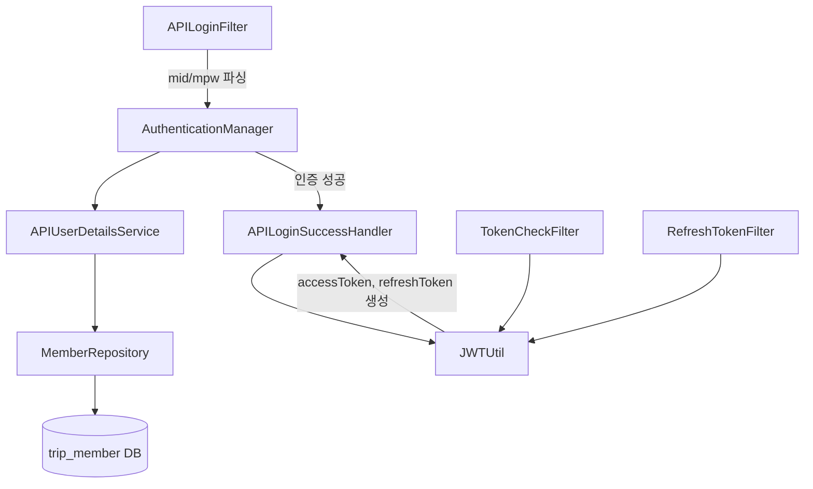
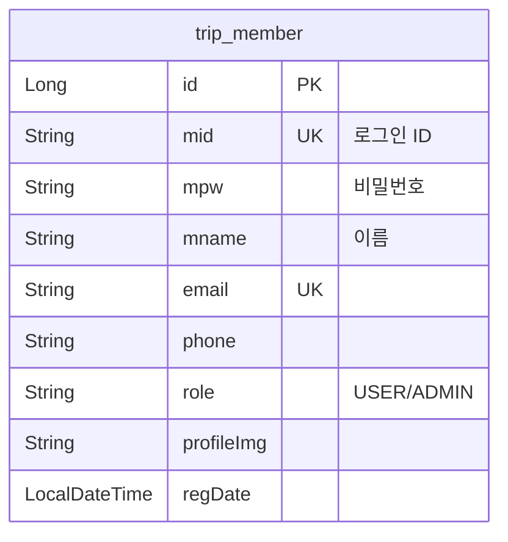
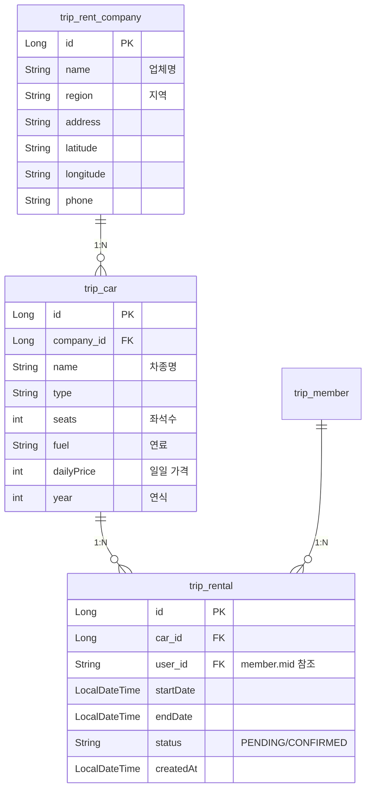
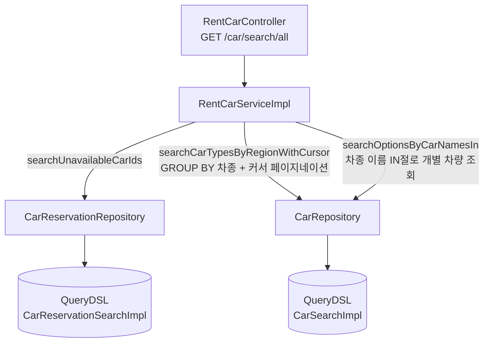
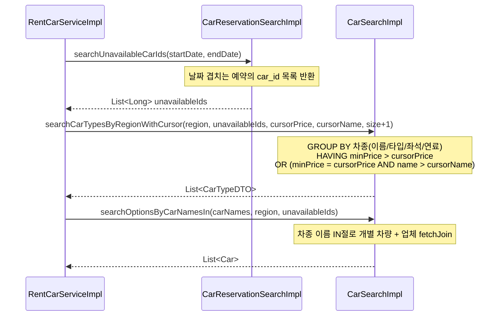
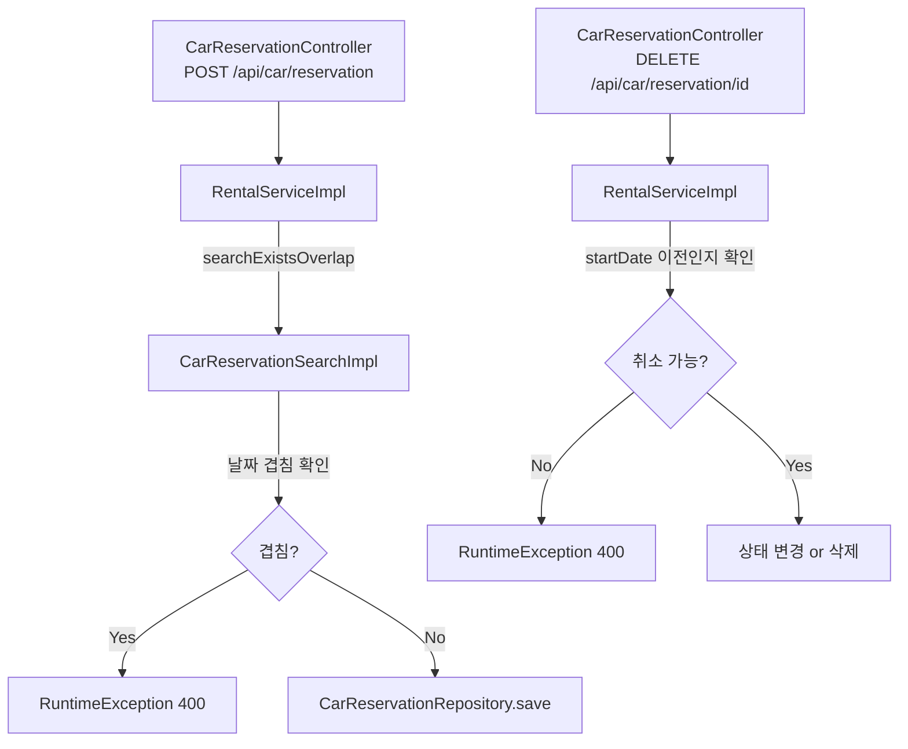
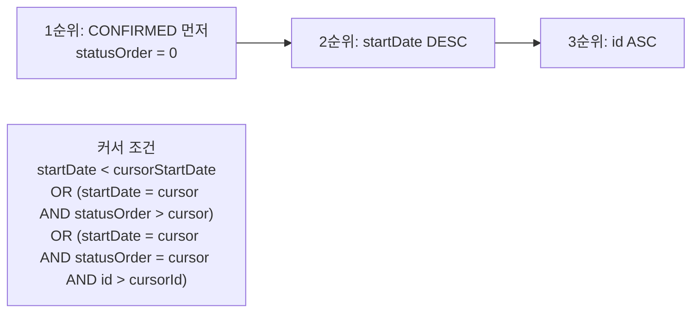
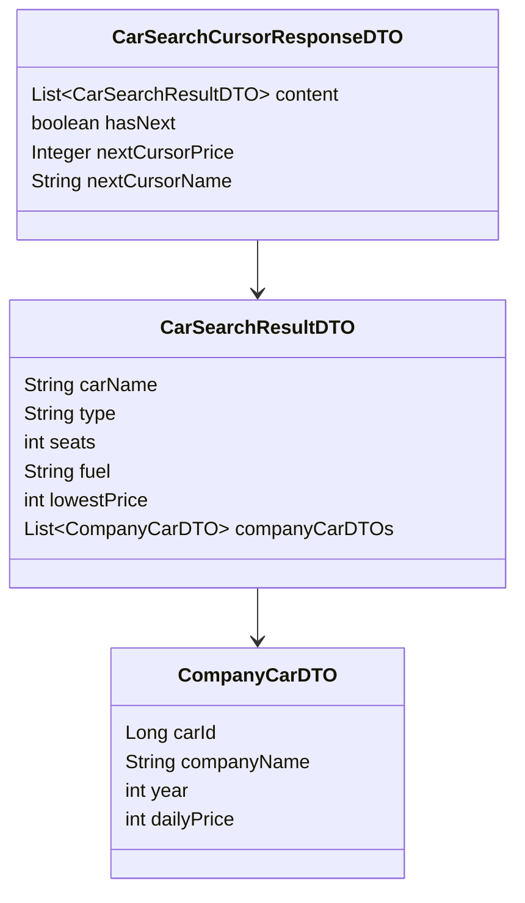

# 🚗 Car (차량 렌트) 백엔드 문서 - Spring

## 🔐 인증 구조

---

## 🗄️ Member 엔티티

---

## 🗄️ 차량 엔티티 관계

---

## 🏗️ 차량 검색 레이어 구조

---

## 🔍 차량 검색 쿼리 흐름

---

## 📝 예약 생성 및 취소

---

## 📋 내 예약 목록 커서 정렬

---

## 📦 응답 DTO 구조

